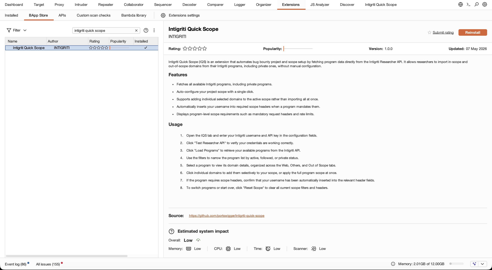
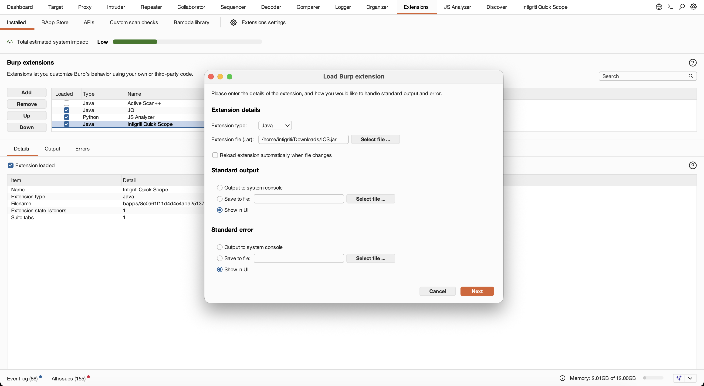

# Intigriti Quick Scope

Intigriti Quick Scope (IQS) is a Burp Suite extension that automates project setup by pulling data from the Intigriti Researcher API. This extension makes it easy to import target scopes from bug bounty programs directly into Burp Suite.

[Learn more](https://www.intigriti.com/blog/news/introducing-intigriti-quick-scope-iqs-burpsuite-extension)

[](https://www.intigriti.com/blog/news/introducing-intigriti-quick-scope-iqs-burpsuite-extension)

## Features
Intigriti Quick Scope (IQS) is designed to help you quickly set up your scope within Burp Suite using the official Intigriti Researcher API.

IQS is currently capable of:
- Fetching all your available programs (including private)
- Auto configuring your Burp Suite's project with a single click
- Inspect program scope requirements such as mandatory request headers or rate limits.

## Installation

<<<<<<< HEAD
### Via BApp Store (recommended)

1. In Burp Suite, go to the "Extensions" tab
2. Switch to the "BApp Store" tab
4. Search for "Intigriti Quick Scope"
5. Finally, click on "Install" to install our official plugin

Alternatively, you can install it directly from the [BApp Store page](https://portswigger.net/bappstore/8e0a61f11d4d4e4aba25137eea1e1164).



### From JAR file

1. Download the latest release JAR file from the [releases page](https://github.com/intigriti/iqs/releases)
2. Open Burp Suite
3. Go to the "Extensions" tab
4. Within the "Installed" sub-tab, click "Add" (underneath the "Burp Extensions" section)
=======
### From JAR file

1. Download the latest release JAR file from the releases page
2. Open Burp Suite
3. Go to the "Extensions" tab
4. Click "Add" in the "Installed" tab (underneath the "Burp Extensions" section)
>>>>>>> bapp-fork-latest/main
5. Set the extension type to "Java"
6. Select your JAR file
7. Click "Next" to load the extension

<<<<<<< HEAD


### From source

1. Clone this repository
2. Build this project with Gradle:
=======
### From source

1. Clone the repository
2. Build using Gradle:
>>>>>>> bapp-fork-latest/main
   ```
   gradle build
   ```
3. The JAR file will be created in the `build/libs/` folder
4. Load the JAR file into Burp Suite as previously instructed

## Usage

### Configure the Intigriti Researcher API
Start by configuring the Intigriti API connection. Enter your Intigriti username and API key, then click "Test Researcher API" to verify your credentials are working.

### Loading programs
Once connected, click "Load Programs" to fetch your available programs. You can narrow the list by toggling the filters for active, followed, or private programs.

### Applying scopes
Select a program to inspect its scope configuration and domain details. Domains are organized into tabs by type, Web, Others (this section includes iOS, Android, source code repositories or other types of applications), and Out of Scope. From there, you can add individual selected domains to your Burp scope or apply the entire program's scope at once. If the program requires scope headers, your username will be automatically inserted.

### Reset your scope configuration
To start fresh, use the "Reset Scope" button to clear all scope filters and headers. You can then import domains from a different program as needed.

## Obtaining an Intigriti API Key

<<<<<<< HEAD
To use this extension, you need an Intigriti researcher account and an active Intigriti API key:
=======
To use this extension, you need an Intigriti account and an active Intigriti API key:
>>>>>>> bapp-fork-latest/main

1. Sign into your Intigriti account
2. Go to your profile settings
3. Navigate to the "API Keys" section
4. Generate a new API key (you can set the expiration time to your preference)
5. Copy the API key to use in the Intigriti Quick Scope extension

## Technical requirements

- Burp Suite Community Edition (CE) or Professional
- Java 11 or later

# Contributions

<<<<<<< HEAD
Intigriti Quick Scope is open-source and made for the community! We encourage you to contribute to the project! Please see the [Contributing guideline](docs/CONTRIBUTING.md) on how to contribute and further improve Intigriti Quick Scope!

> [!WARNING]
> Security bugs should be reported via our [Vulnerability Disclosure Program (VDP)](https://app.intigriti.com/vdp). See [SECURITY.md](docs/SECURITY.md) for more details.

# License

This project is licensed and available under the [MIT License](LICENSE.md)
=======
Scope Guard is open-source and made for the community! We encourage you to contribute to the project! Please see the [Contributing guideline](docs/CONTRIBUTING.md) on how to contribute and further improve Scope Guard!

> [!WARNING]
> Security bugs should be reported to our security contact at [security@intigriti.com](mailto:security@intigriti.com). See [SECURITY.md](docs/SECURITY.md) for more details.

# License

This project is licensed and available under the [MIT License](docs/LICENSE.md)
>>>>>>> bapp-fork-latest/main
